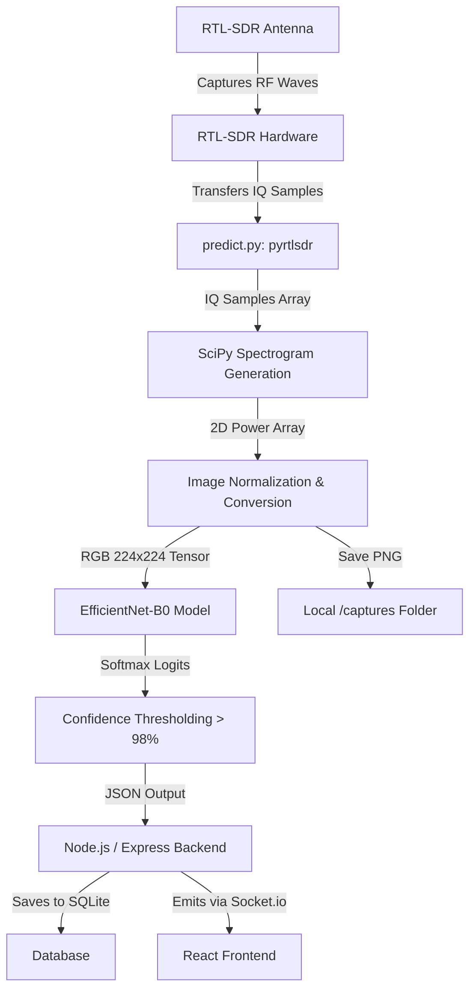

# Flying Wings: Drone RF Detection Workflow

This document details the exact sequence of events that occurs when the system performs a continuous scan, from capturing the physical Radio Frequency (RF) signals via the RTL-SDR hardware to displaying the alert on the frontend dashboard.

## System Architecture & Data Pipeline

## Step-by-Step Breakdown

### 1. Hardware Signal Capture (`predict.py`)
When a scan is initiated, the `RtlSdr` class from the `pyrtlsdr` library interfaces with the RTL-SDR USB dongle. 
* **Action:** The hardware tunes to a specific center frequency (e.g., 915 MHz) and samples the airwaves at a high rate (e.g., 2.0 MHz).
* **Output:** It produces **raw IQ (In-phase and Quadrature) samples**—complex numbers representing the amplitude and phase of the radio waves over time.

### 2. Spectrogram Generation (`SciPy`)
Raw time-domain IQ samples are not easily understandable by image classification models. They must be transformed into the frequency domain.
* **Action:** `scipy.signal.spectrogram` is applied to the IQ samples. This uses a Fast Fourier Transform (FFT) over sliding windows of the signal.
* **Output:** A 2D array representing Power Spectral Density (PSD), where one axis is Time, the other is Frequency, and the values are signal strength.

### 3. Image Conversion & Normalization
The mathematical power array is converted into a standard optical image format so the pre-trained EfficientNet model can read it.
* **Action:** 
  1. The PSD values are converted to a logarithmic decibel (dB) scale (`10 * log10`).
  2. The values are min-max normalized and scaled to `0-255` (standard 8-bit grayscale pixels).
  3. The `PIL` library resizes the array to `224x224` pixels.
  4. The single grayscale channel is duplicated three times to simulate an RGB image (since EfficientNet requires 3 color channels).

### 4. Neural Network Inference (`PyTorch`)
The formatted spectrogram image is fed into the AI model.
* **Action:** The image is converted into a PyTorch tensor, normalized with standard ImageNet statistics, and passed through the `EfficientNet-B0` architecture.
* **Output:** The model outputs raw logits which are converted into percentages via a `softmax` function, determining the confidence for "drone" and "noise" classes.

### 5. Strict Thresholding
To prevent false alarms caused by random RF interference (like walkie-talkies or cosmic noise), a strict filter is applied.
* **Action:** If the model predicts "drone", it checks the confidence score. If the confidence is **below 98%**, the prediction is forcibly inverted to "noise". This ensures only highly-structured, definite drone signatures trigger an alert.

### 6. Saving Local Captures
* **Action:** Regardless of the prediction, the 224x224 spectrogram image is saved to the local `captures/` folder. 
* **Naming:** It is saved as either `sdr_drone_alert_YYYYMMDD_HHMMSS.png` or `sdr_clear_image_YYYYMMDD_HHMMSS.png`.

### 7. Backend Processing (`detection.js`)
The Python script finishes executing and prints a JSON object containing the prediction, confidence, and latency to standard output.
* **Action:** The Node.js `spawn` process captures this output, parses the JSON, and evaluates it.
* **Database:** It writes the scan result to the SQLite database (updating `scanCount`, `droneCount`, and storing the historic record).

### 8. Real-time Frontend Updates (`React & Socket.io`)
* **Action:** The backend uses `Socket.io` to instantly broadcast the detection payload to all connected clients.
* **Display:** The React `App.jsx` receives the event. It increments the dashboard statistics, adds a new row to the Live Detection History table, and if the prediction was "drone", it triggers the red Alert Banner and audio warning.

### 9. Continuous Loop
The Express backend tracks the precise execution time of the entire Python process. It calculates exactly how long to wait before starting the exact same pipeline again to ensure a flawless 2.0-second cadence.
